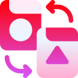
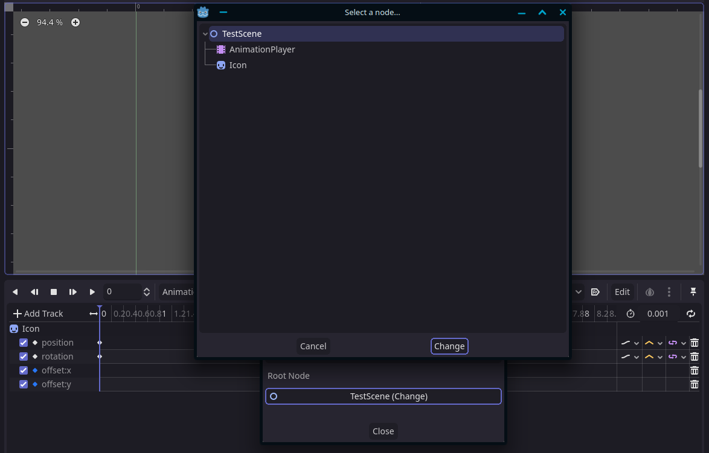

#  Animation Player Refactor
A Godot addon for refactoring animations for the `AnimationPlayer`. 

Edit property references, delete tracks, and even change the root node of the Animation Player without breaking all the path references. No need to manually update every single track everytime you move or rename a node and properties in the scene.

## Features
Adds a "Refactor" menu option to the animation panel, with the following features:
 - Rename tracks and properties
 - Delete tracks and properties
 - Change the root node path
 - Marks invalid properties/nodes
 - Full undo/redo support

📄 Note that this addon only refactor *Animations*, so deleting or renaming node does not affect the actual nodes. It is recommended to move/rename the actual nodes first, and then use the plugin to fix broken animations.

⚠️ Please make sure to use proper version control with this addon to prevent losing changes.

## Screenshots

Menu options:

Changing root node:

<a href="https://www.flaticon.com/free-icons/refactoring" title="refactoring icons">Logo icon created by Freepik - Flaticon</a>
