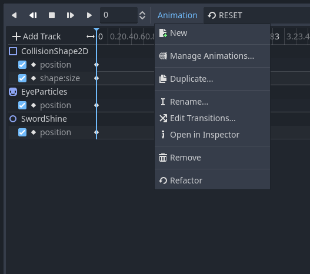
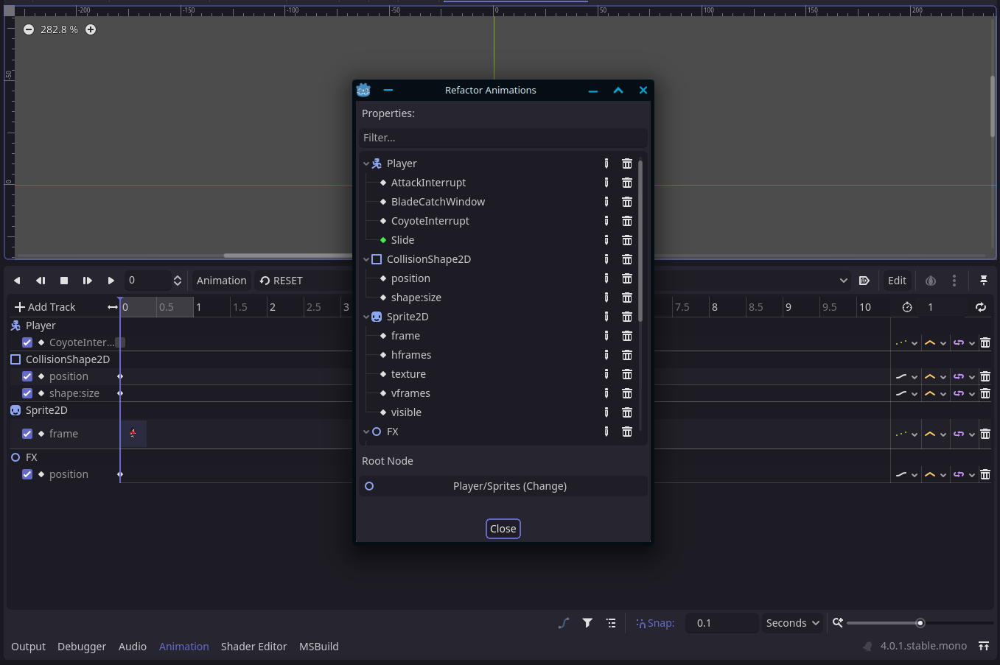

# Animation Player Refactor
A Godot addon to easily refactor Animation Player tracks.

|  |  |
| -- | -- |

## Features
 - Rename value tracks
 - Rename methods
 - Rename track nodes
 - Change root node